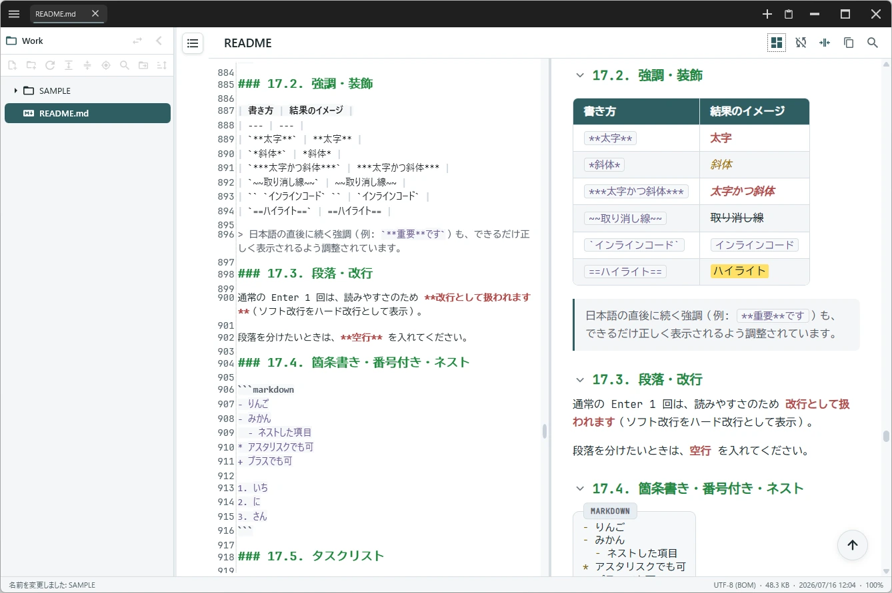
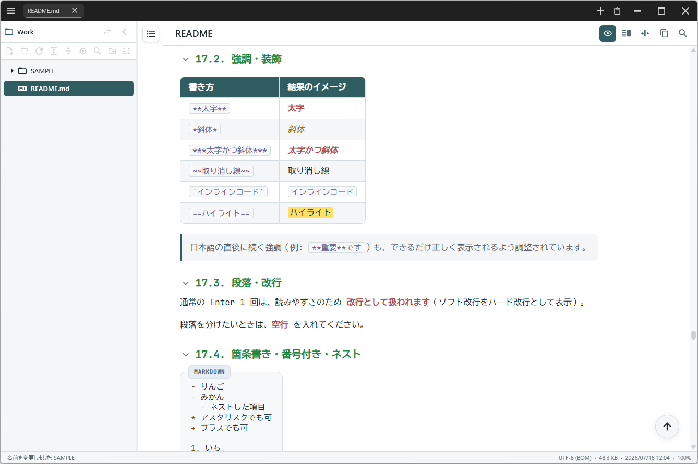
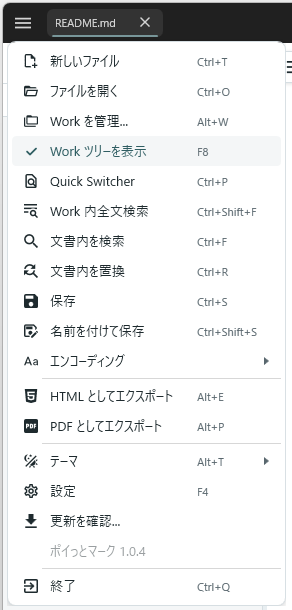

  
  <h1>ポイっとマーク</h1>
  
<strong>書く・読む・探すを、ひとつの軽快な Markdown ワークスペースに。</strong>

  
  
  

  [最新版をダウンロード](https://github.com/Samek86/PoitoMark-releases/releases/latest)

---

PoitoMark は、Markdown の閲覧・編集・整理をひとつの画面で行える Windows アプリです。単一の実行ファイルを置くだけで使い始められます。

## スクリーンショット

### 編集とプレビューを並べて確認

<table>
  <tr>
    <td width="78%"></td>
    <td width="22%"></td>
  </tr>
  <tr>
    <td align="center"><strong>読みやすい閲覧モード</strong></td>
    <td align="center"><strong>機能へすぐアクセス</strong></td>
  </tr>
</table>

## 主な機能

| | 機能 |
| --- | --- |
| **快適な編集** | 閲覧・編集・分割表示、エディターとプレビューのスクロール同期 |
| **すぐ見つかる** | Work ツリー、クイック切替、全文検索、見出し目次 |
| **豊かな表示** | シンタックスハイライト、Mermaid、コールアウト、タスクチェック |
| **自分好みに** | Light／Dark テーマ、配色・フォント・表示幅のカスタマイズ |
| **作業を守る** | 自動保存、タブとセッションの復元 |
| **共有できる** | HTML／PDF エクスポート |

## はじめかた

1. [最新リリース](https://github.com/Samek86/PoitoMark-releases/releases/latest)から `PoitoMark.exe` をダウンロードします。
2. 書き込み可能な任意のフォルダーへ置きます。
3. `PoitoMark.exe` を実行します。

初回起動時に既定の Work と操作マニュアルが作成されます。アプリ内の左ペインから `README` を開くと、詳しい操作方法を確認できます。

## 動作環境

- Windows 10 / 11（64 bit）
- .NET Framework 4.8.1
- Microsoft Edge WebView2 Runtime

> [!NOTE]
> 現在の実行ファイルにはコード署名がないため、初回起動時は Windows のセキュリティ確認に時間がかかる場合があります。公式リリースから取得したファイルであることを確認して実行してください。通常、2回目以降は短時間で起動します。

## ライセンス

本プロジェクトのライセンスは [GPL-3.0](LICENSE) です。使用しているライブラリのライセンスは、アプリの **設定 → ライブラリのライセンス** から確認できます。
